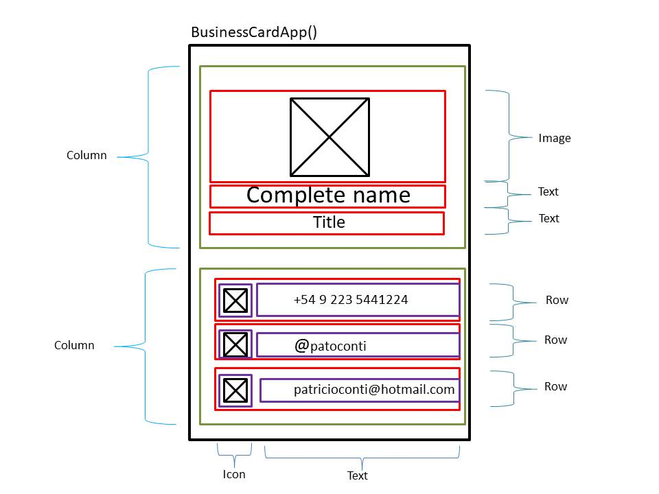
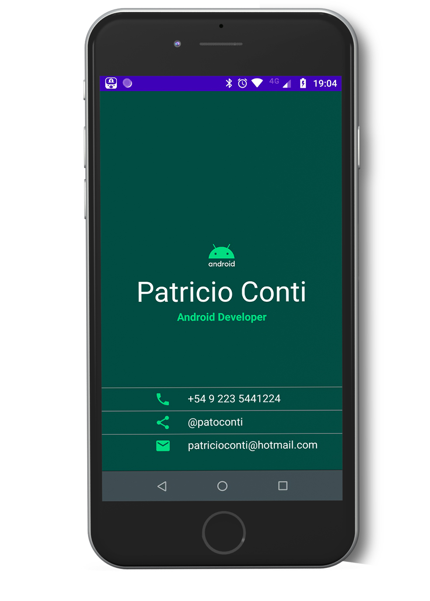

Business Card App
===================================

Overview
--------------
A Business Card screen using Jetpack Compose.

It is the Unit 1 final project from the Google Android Basics with Compose course.

Layout Structure
--------------

Language 
--------------
Kotlin

Screenshots
--------------

Purpose
--------------
This code demonstrates how I implemented a simple Compose Layout using column, rows, images, text, icons and dividers.

Getting Started
---------------
1. Download and run the app.

## Developed By

Patricio Conti

